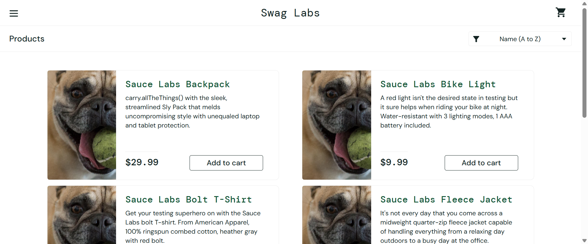
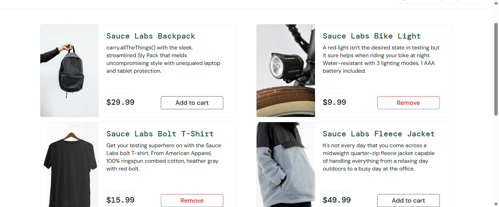
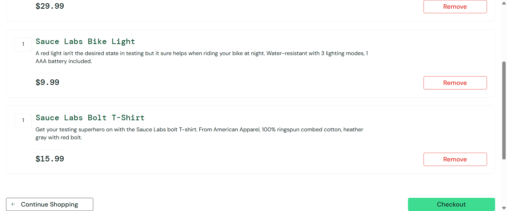
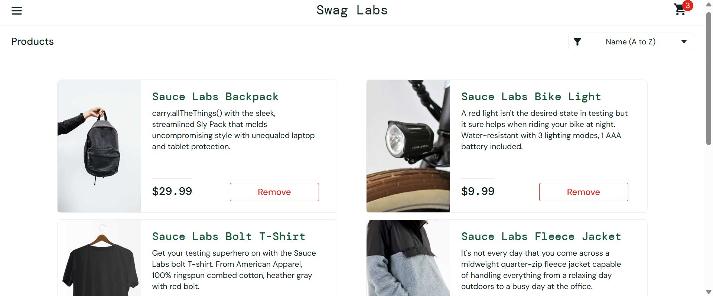
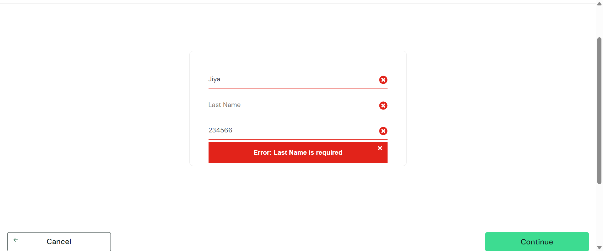
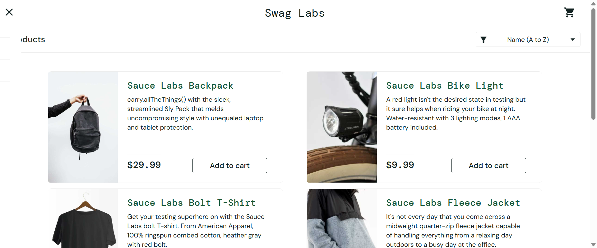

# Selenium Automation Framework

## Project Overview

This project is a Hybrid Selenium Automation Framework developed using Java, Selenium WebDriver, TestNG, Maven, and Jenkins for automating the SauceDemo application.

The framework follows the Page Object Model (POM) design pattern and includes reusable utilities, reporting, listeners, retry mechanisms, Excel integration, screenshots, parallel execution, and CI/CD support.

---

# Tech Stack

* Java
* Selenium WebDriver
* TestNG
* Maven
* Jenkins
* Git & GitHub
* Apache POI
* Extent Reports

---

# Framework Features

## Page Object Model (POM)

Implemented separate page classes for:

* Login Page
* Home Page
* Cart Page
* Checkout Page
* Menu Page
* Product Sorting Page

---

## TestNG Features

* Assertions
* DataProvider
* Parallel Execution
* Retry Failed Tests
* TestNG XML Execution
* Listeners

---

## Reporting

Implemented Extent Reports with:

* Timestamped Reports
* Screenshot Attachments
* Pass/Fail Logging
* System Information

---

## Utilities

Reusable utility methods for:

* Explicit Waits
* Element Waits
* Alert Handling
* Screenshot Capture
* Excel Read/Write

---

## Excel Integration

Implemented Excel-driven testing using Apache POI:

* Read test data from Excel
* Write PASS/FAIL status back to Excel

---

## Jenkins Integration

Configured Jenkins for:

* Automated Build Execution
* Maven Test Execution
* CI/CD Workflow

---

# Project Structure

```text
src/main/java
│
├── base
├── pages
├── utils
├── resources
│
src/test/java
│
├── tests
```

---

# Automated Test Scenarios

## Login Module

* Valid Login
* Invalid Login
* Locked User Validation

## Product Module

* Product Page Validation
* Add to Cart
* Remove Product

## Cart Module

* Cart Count Validation
* Multiple Product Addition

## Checkout Module

* Complete Checkout Flow
* Invalid Checkout Validation
* Continue Shopping
* Cancel Checkout

## Menu Module

* Verify Menu Items
* Logout Validation

## Product Sorting Module

* Name (A-Z)
* Name (Z-A)
* Price (Low-High)
* Price (High-Low)

---

# Parallel Execution

Implemented ThreadLocal WebDriver for safe parallel execution.

Example:

```xml
<suite name="SeleniumTests" parallel="methods" thread-count="3">
```

---

# Screenshots

Screenshots are automatically captured for:

* Failed Tests
* Skipped Tests
* Timeout Failures

---
# Test Screenshots

## Login Test



## Add To Cart Test



## Checkout Test



## Continue Shopping



## Invalid Checkout Validation



## Menu Validation


## Product Sorting Validation


## Logout Validation



---
# Run the Project

## Using Maven

```bash
mvn test
```

---

## Using TestNG XML

```bash
Right Click → testNG.xml → Run As → TestNG Suite
```

---

# ⚙️ Configuration

Framework configuration is maintained using:

```properties
config.properties
```

Example:

```properties
browser=chrome
url=https://www.saucedemo.com/
username=standard_user
password=secret_sauce
timeout=10
headless=false
```

---

# Reports Location

```text
/reports
```

---

# Future Enhancements

* REST Assured API Automation
* Docker Integration
* Selenium Grid
* Cross Browser Testing

---

# Author

PoojaSN-Automates

GitHub:
[https://github.com/PoojaSN-Automates](https://github.com/PoojaSN-Automates)
